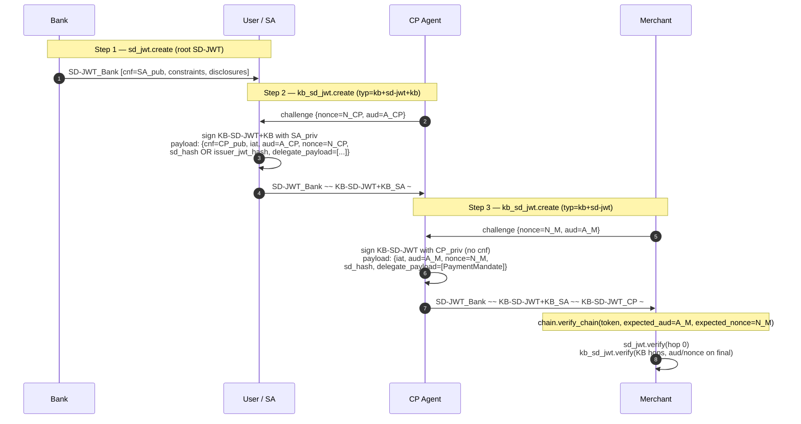

# AP2 Python SDK

Runtime for the Agent Payments Protocol: mandate issuance, presentation,
verification, and receipts. Built on SD-JWT / KB-JWT with dSD-JWT
delegation chains of arbitrary depth.

## Layout

The SD-JWT implementation lives under `sdjwt/`; the AP2 facade wires it into
mandate creation, presentation, and verification:

- `sdjwt/sd_jwt.py` — root, issuer-signed SD-JWT (RFC 9901 §4). Owns
  root token `create` and `verify`; hash helpers are exported from
  `ap2.sdk.sdjwt`.
- `sdjwt/kb_sd_jwt.py` — KB-SD-JWT hops (draft §5.1.4). Intermediate hops
  use `typ=kb+sd-jwt+kb` and require `cnf`; terminal hops use
  `typ=kb+sd-jwt` and must not carry `cnf`.
- `sdjwt/chain.py` — `verify_chain`: walks the `~~`-joined chain, follows
  `cnf`, dispatches per-hop to the right primitive.
- `sdjwt/common.py` — parsing, hashing, and shared SD-JWT helpers.
- `mandate.py` — `MandateClient` facade (`create` / `present` /
  `verify`) + `SdJwtMandate[T]` typed wrapper.
- `receipt_wrapper.py` — `ReceiptClient` (create / verify receipts).
- `disclosure_metadata.py` — selective-disclosure rules.
- `constraints.py`, `payment_mandate_chain.py`,
  `checkout_mandate_chain.py` — typed chain wrappers and
  constraint checking.
- `jwt_helper.py` — plain ES256 JWTs (used for receipt signing).
- `utils.py` — `compute_sha256_b64url`, etc.
- `generated/` — Pydantic models emitted from the JSON schemas.

### How the primitives slot into the flow



### Hiding disclosures from the next delegate

Each KB-SD-JWT hop binds to the preceding token with either
`sd_hash` (covers the preceding JWT *and* disclosures) or
`issuer_jwt_hash` (covers only the preceding JWT, so disclosures
are free to change). Pick the mode via
`MandateClient.present(..., hash_mode="sd_hash" | "issuer_jwt_hash")`.

- `"sd_hash"` (default): locks in the exact disclosures the current
  hop forwards. Next delegate cannot further redact them.
- `"issuer_jwt_hash"`: lets the next delegate drop disclosures
  from the preceding SD-JWT without breaking chain integrity. Use
  when the current hop wants to permit downstream privacy-minimization.

### Deviations from draft-gco-oauth-delegate-sd-jwt-00

- **No dSD-JWT+KB shape.** AP2 always terminates with a
  `typ=kb+sd-jwt` KB-SD-JWT whose payload carries
  `aud`/`nonce`/`sd_hash` by spec (a KB-SD-JWT IS a KB-JWT).
  The alternative outer `+KB` shape with a separate trailing
  plain KB-JWT is not emitted and not accepted.

## Public API

### `MandateClient`

| Method | What it does |
| --- | --- |
| `create(payloads, issuer_key, sd=None)` | Sign a root SD-JWT via `sd_jwt.create`. `sd=None` auto-derives selective disclosure from the payload model's `x-selectively-disclosable-*` annotations. |
| `present(holder_key, mandate_token, payloads, claims_to_disclose=None, nonce=None, aud=None, hash_mode="sd_hash")` | Append one delegation hop on top of `mandate_token` via `kb_sd_jwt.create`. Open mandates with `cnf` create intermediate hops; closed mandates create terminal hops. Pass `hash_mode="issuer_jwt_hash"` to let the next delegate redact disclosures from the preceding SD-JWT. Call again on the result for more hops. |
| `verify(token, key_or_provider, payload_type=None, expected_aud=None, expected_nonce=None, ...)` | Unified verifier via `chain.verify_chain`. `token` can be a single SD-JWT or any-depth `~~`-joined chain. Returns `SdJwtMandate[T]` for single, `list[dict]` of per-token effective payloads for chains. |
| `get_closed_mandate_jwt(token)` | The leaf JWT of the chain (last `~~` segment, before any `~`). Its `sha256` is the canonical receipt `reference` — stable across depth and disclosure choices. |

`claims_to_disclose` in `present()`: `None` → reveal all, `{}` → reveal
nothing, dict → reveal named fields.

### `ReceiptClient`

| Method | What it does |
| --- | --- |
| `create_payment_receipt(payment_mandate_content, reference)` | Build a `PaymentReceipt` model. Sign separately with `create_jwt`. |
| `create_checkout_receipt(merchant, reference, order_id)` | Build a `CheckoutReceipt` model. Sign separately with `create_jwt`. |
| `verify_receipt(receipt_jwt, receipt_issuer_public_key, has_reference_in_store_cb=None, is_payment_receipt=True)` | Verify the ES256 signature and, if the callback is supplied, that `reference` points to a known closed mandate. |

Canonical receipt reference:

```python
reference = compute_sha256_b64url(
    MandateClient().get_closed_mandate_jwt(chain)
)
```

## Data models (`generated/`)

| Model | `vct` | Role |
| --- | --- | --- |
| `OpenPaymentMandate` | `mandate.payment.open` | Open payment mandate + constraints |
| `OpenCheckoutMandate` | `mandate.checkout.open` | Open checkout mandate + line-item rules |
| `PaymentMandate` | `mandate.payment` | Closed payment mandate |
| `CheckoutMandate` | `mandate.checkout` | Closed checkout mandate |
| `PaymentReceipt` / `CheckoutReceipt` | — | Receipt payloads (discriminated success/error) |
| `Amount`, `Merchant`, `PaymentInstrument`, … | — | Shared types in `ap2.sdk.generated.types` |

Selective-disclosure annotations on the models:

| Field | Model | Annotation |
| --- | --- | --- |
| `checkout_jwt` | `CheckoutMandate` | `x-selectively-disclosable-field` |
| `allowed` | `AllowedPayees` | `x-selectively-disclosable-array` |
| `allowed` | `AllowedPaymentInstruments` | `x-selectively-disclosable-array` |
| `allowed_merchants` | `AllowedMerchants` | `x-selectively-disclosable-array` |
| `acceptable_items` | `LineItemRequirements` | `x-selectively-disclosable-array` |

## Wire format

A dSD-JWT chain has arbitrary depth. Hops are joined by `~~`:

```
<root_SD-JWT>~<disc…>~~<KB-SD-JWT+KB_1>~<disc…>~~…~~<closed_KB-SD-JWT>~<disc…>~
```

- **Root SD-JWT** — issued by the root of trust (in AP2, typically the
  bank / agent provider). Contains `cnf` so the next hop can sign on top.
- **Intermediate KB-SD-JWT+KBs** (`typ=kb+sd-jwt+kb`) — each signed by
  the previous hop's `cnf.jwk` and carrying its own `cnf`. Any number of
  them (zero or more). Binds to the preceding hop via `sd_hash` or
  `issuer_jwt_hash`, and carries `iat`, `aud`, `nonce`.
- **Closed mandate (leaf)** (`typ=kb+sd-jwt`) — final KB-SD-JWT with a
  `PaymentMandate` or `CheckoutMandate` payload and no outgoing `cnf`.
  Binds to the preceding hop via `sd_hash` or `issuer_jwt_hash`, and
  carries `iat` plus (optionally) `aud`/`nonce`.

A KB-SD-JWT *is* a KB-JWT (draft §5.1.4), so the binding/transaction
claims live in its payload — AP2 does not emit the dSD-JWT+KB variant
with a separate trailing plain KB-JWT.

Header `typ`: `kb+sd-jwt+kb` when the payload contains `cnf` (open,
further delegation possible), `kb+sd-jwt` otherwise (closed, terminal).

## Trust chain

```
Root issuer
    │ signs
    ▼
┌────────────────────────────┐
│ Root SD-JWT                │
│ constraints, cnf = Del_1   │──┐
└────────────────────────────┘  │ cnf delegates
                                ▼
                        ┌───────────────────────────────┐
            Del_1 signs │ KB-SD-JWT (open)              │
                        │ sd_hash, cnf = Del_2          │──┐  (repeat for any
                        └───────────────────────────────┘  │   number of hops)
                                                           ▼
                                                 ┌─────────────────────────────┐
                                     Final       │ Closed KB-SD-JWT            │
                                     delegate    │ typ=kb+sd-jwt               │
                                     signs ────▶ │ sd_hash, aud, nonce, iat    │
                                                 │ delegate_payload = {        │
                                                 │   vct: mandate.payment, …   │
                                                 │ }                           │
                                                 └─────────────────────────────┘
```

Verifier trusts only the root issuer key. Every hop is validated by the
preceding hop's `cnf.jwk`; the closed mandate's `sd_hash` binds to the
entire preceding chain; the receipt's `reference = sha256(closed leaf JWT)`
binds the post-settlement receipt to the authorized mandate.

## Example

```python
import json, time
from cryptography.hazmat.primitives.asymmetric import ec
from jwcrypto.jwk import JWK

from ap2.sdk.mandate import MandateClient
from ap2.sdk.payment_mandate_chain import PaymentMandateChain
from ap2.sdk.utils import compute_sha256_b64url
from ap2.sdk.generated.open_payment_mandate import (
    AllowedPayees, AmountRange, OpenPaymentMandate,
)
from ap2.sdk.generated.payment_mandate import PaymentMandate
from ap2.sdk.generated.types.amount import Amount
from ap2.sdk.generated.types.merchant import Merchant
from ap2.sdk.generated.types.payment_instrument import PaymentInstrument


def jwk_with_kid(raw_key, kid):
    d = json.loads(JWK.from_pyca(raw_key).export())
    d["kid"] = kid
    return JWK(**d)


issuer_jwk = jwk_with_kid(ec.generate_private_key(ec.SECP256R1()), "issuer-1")
agent_jwk  = jwk_with_kid(ec.generate_private_key(ec.SECP256R1()), "agent-1")
agent_pub  = json.loads(agent_jwk.export_public())
client     = MandateClient()
now        = int(time.time())

# 1. Issue the open (root) mandate.
open_token = client.create(
    payloads=[OpenPaymentMandate(
        constraints=[
            AmountRange(currency="USD", min=0, max=5000),
            AllowedPayees(allowed=[Merchant(id="M-1", name="Cat Store")]),
        ],
        cnf={"jwk": agent_pub},
        iat=now, exp=now + 3600,
    )],
    issuer_key=issuer_jwk,
)

# 2. Agent creates the closed mandate on top (one delegation hop).
chain = client.present(
    holder_key=agent_jwk,
    mandate_token=open_token,
    payloads=[PaymentMandate(
        transaction_id="tx_abc",
        payee=Merchant(id="M-1", name="Cat Store"),
        payment_amount=Amount(amount=2500, currency="USD"),
        payment_instrument=PaymentInstrument(type="card", id="stub", description="Demo"),
        iat=now, exp=now + 3600,
    )],
    nonce="tx_abc",
    aud="merchant",
)

# 3. Merchant verifies.
payloads = client.verify(
    token=chain,
    key_or_provider=lambda token: issuer_jwk,
    expected_aud="merchant",
    expected_nonce="tx_abc",
)
parsed = PaymentMandateChain.parse(payloads)
violations = parsed.verify(expected_transaction_id="tx_abc")
assert not violations

# 4. Receipt reference binds to the closed leaf JWT.
reference = compute_sha256_b64url(client.get_closed_mandate_jwt(chain))
```

Add another hop by calling `client.present()` again with the returned
`chain` as `mandate_token`; verification and the receipt reference stay
identical in shape.

## Verification (under the hood)

`chain.verify_chain` (called by `MandateClient.verify`) walks the chain:

1. Split on `~~`; normalize each segment so its on-wire form matches what
   the signer saw.
2. Token 0 uses `sd_jwt.verify(token, key_or_provider(parsed_token))`.
   Providers that need `x5c` certificate validation should own their trusted
   roots, for example via `X5cOrKidPublicKeyProvider`.
3. KB-SD-JWT hops dispatch to `kb_sd_jwt.verify`, which validates either
   `typ=kb+sd-jwt+kb` (`cnf` required) or `typ=kb+sd-jwt` (no `cnf`).
   Each hop checks either `sd_hash` or `issuer_jwt_hash` against the
   preceding token.
4. The final token additionally enforces `expected_aud` / `expected_nonce`
   when provided.
5. Return the per-token effective payloads (extracted from
   `delegate_payload[0]` when present). Feed them to
   `PaymentMandateChain.parse` / `CheckoutMandateChain.parse` for typed
   access and `verify(...)` for constraint checks.

## Receipt binding

Every receipt creator and every mandate store in the AP2 samples routes
through the same helper, so receipts stay valid regardless of delegation
depth or disclosure selection:

```python
reference = compute_sha256_b64url(
    MandateClient().get_closed_mandate_jwt(chain)
)
```
